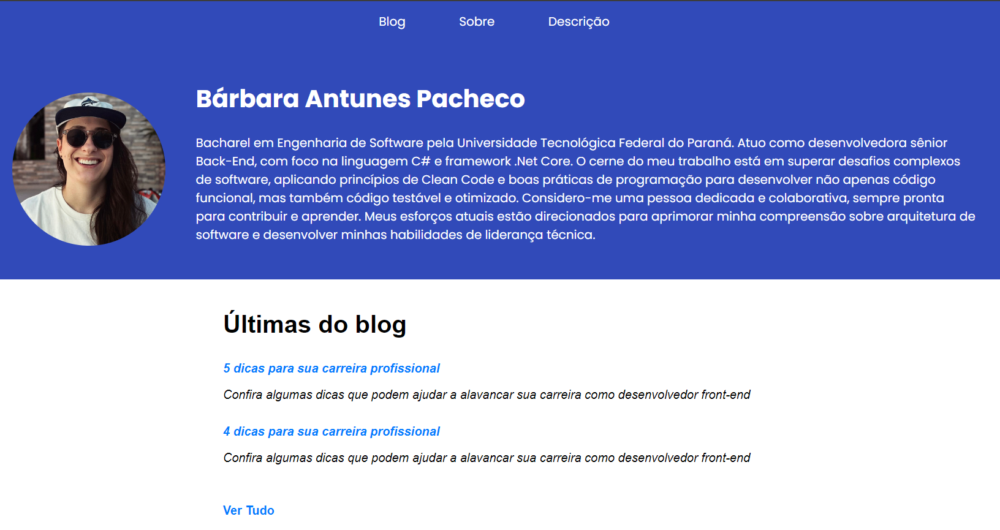

# Blog React App
Projeto para a disciplina de **Arquitetura Front-end**, parte do curso de Pós-graduação em Arquitetura de Software Distribuído.

### Tecnologias utilizadas:
- React:
  > O React é uma biblioteca front-end JavaScript de código aberto com foco em criar interfaces de usuário em páginas web.

### Requisitos para a compilação do projeto: 
- Instalação NodeJs.
    > https://nodejs.org/en/download/package-manager 
- Instalação IDE visual studio code.
    > https://code.visualstudio.com/download

### Instruções para a execução do projeto:
- Abrir a IDE;
- Abrir terminal;
- Executar comando `npm install`;
- Executar comando `npm start`;
- O projeto estará disponível em: http://localhost:3000/
